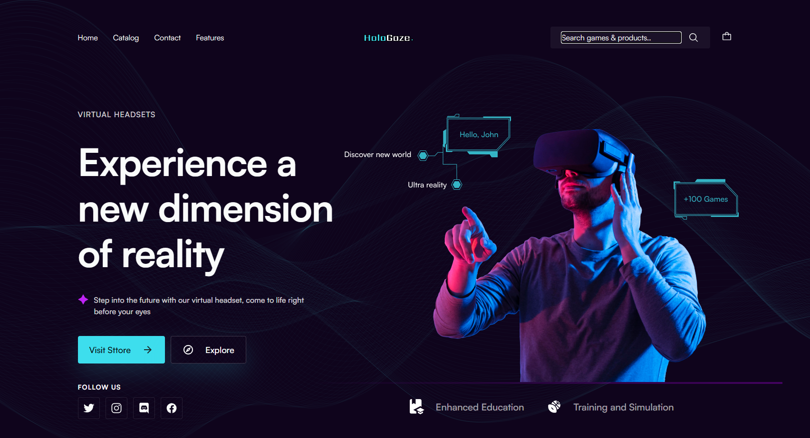

### Desafios e Soluções

📐 **Organização das Múltiplas Seções**  
A principal dificuldade no desenvolvimento deste projeto foi organizar as várias seções do site de maneira coerente e funcional. A utilização do flexbox foi fundamental para garantir que todos os containers fossem dispostos corretamente, respeitando o design especificado no Figma.

🎨 **Uso de Propriedades no React para Troca Dinâmica de Estilos**  
O uso de propriedades no React foi essencial para permitir a troca dinâmica de estilos, proporcionando uma solução eficiente para a personalização e interatividade da página.

🃏 **Construção e Estilização dos Cards**  
A criação e estilização dos cards foram particularmente desafiadoras, o que me levou a buscar alternativas e soluções em fóruns de tecnologia, além de contar com discussões construtivas com colegas da área. O desejo de alcançar a perfeição me motivou a recorrer a ajuda externa, o que foi crucial para o sucesso deste projeto.

📐 **Projeto no Figma**  
O layout seguido à risca durante o desenvolvimento pode ser visualizado no projeto original no Figma [aqui](<https://www.figma.com/design/qlYiQzJNd7qBvQ8sXi4AQn/Virtual-Headset-Landing-Page-UI-FREEBIE-(Community)?node-id=0-1&node-type=CANVAS&t=ios7KNR77XP5Bo0I-0>).

🛠️ **Trabalho no Ambiente de Produção**  
Durante o processo de deploy na Vercel, encontrei alguns erros inesperados. Inicialmente, após pesquisar a causa, descobri que deveria configurar um arquivo de configuração específico da Vercel. Mesmo após essa adição, o erro persistiu, exigindo uma investigação mais aprofundada. A solução foi ajustar o arquivo raiz de rotas do projeto, o que resolveu o problema. O deploy do website pode ser conferido [aqui](https://tech-solutions-kappa.vercel.app/).

💼 **Portfólio**  
Sinto-me extremamente satisfeito por ter concluído este projeto, que não só expandiu meu conhecimento no framework como também solidificou minhas habilidades em JavaScript, React, e suas diversas bibliotecas. Este website agora faz parte do meu portfólio, disponível neste [link](https://sergio-oliveira-portfolio.vercel.app/), e estou orgulhoso de demonstrar meu desenvolvimento técnico, bem como minha capacidade de superar desafios complexos ao longo do processo.
